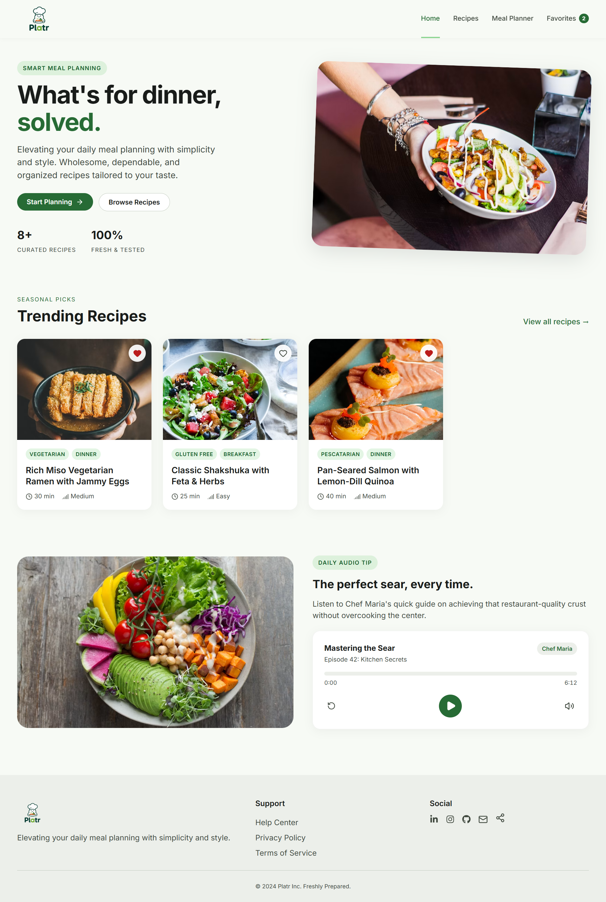
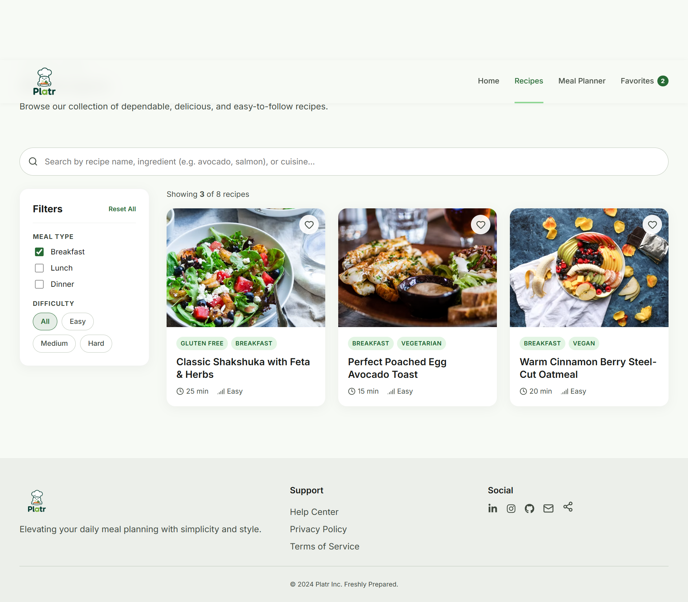
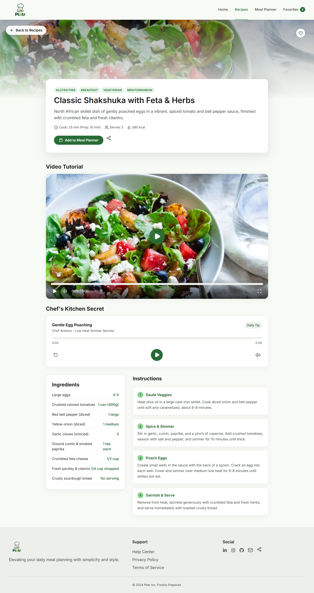
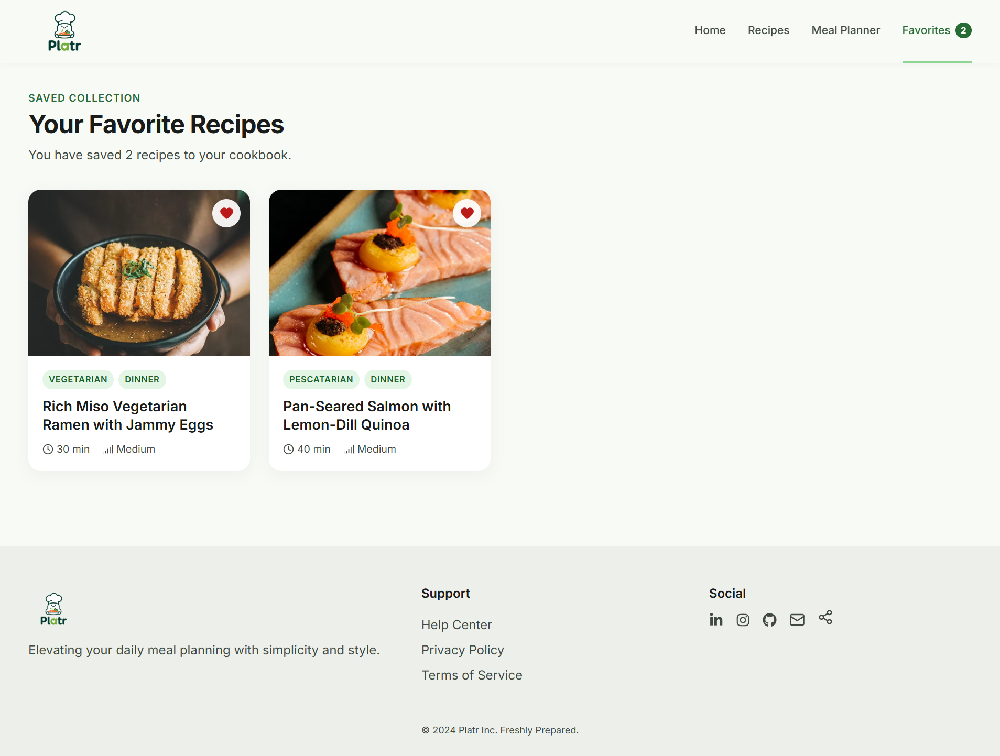
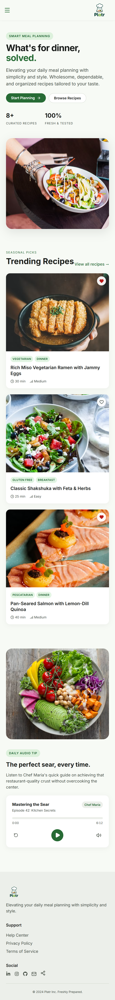

# Platr: Smart Recipe and Meal Planning Application

A modern, responsive React web application for recipe discovery, nutritional planning, weekly meal scheduling, and bookmarking favorite culinary ideas.

---

## Application Screenshots

### 1. Home and Trending Picks



### 2. Search and Multi-Faceted Filters



### 3. Dynamic Recipe Detail and Video Player



### 4. Weekly Meal Planner


### 5. Bookmarked Favorites



### 6. Responsive Mobile View



---

## Key Features

1. **Centralized Recipe Catalog (`recipesData.js`)**:
   - 17 complete recipes across Breakfast (3), Lunch (4), Dinner (5), Dessert (3), and Snacks (2), with cook times, servings, calories, difficulty ratings, dietary tags, ingredient lists, and step-by-step instructions.

2. **Live Search and Multi-Faceted Filters**:
   - Real-time text search across titles, ingredients, and tags with one-click clear.
   - Meal type checkboxes (Breakfast, Lunch, Dinner, Dessert, Snacks), cuisine checkboxes, difficulty chips (Easy, Medium, Hard), and sort by title, cook time, or difficulty.
   - Dynamic empty states with "Reset Filters" action.

3. **Dynamic Recipe Detail Routing (`/recipes/:id`)**:
   - Dynamic `useParams()` lookup with 404 fallback.
   - Native HTML5 **Video Player** for cooking tutorials and **Audio Player** for chef tips.
   - Interactive **Add to Meal Planner** modal to schedule recipes into any day/slot.
   - One-click favorite toggling and link sharing with toast confirmation.

4. **Weekly Meal Planner (`/meal-planner`)**:
   - 7-day calendar view across `breakfast`, `lunch`, and `dinner` slots.
   - Direct inline recipe picker for empty slots and removal buttons on scheduled meals.
   - Week navigation (Prev / Next) and safety-confirmed "Clear Week" functionality.
   - Continuous `localStorage` synchronization via custom hook.

5. **Favorites System (`/favorites`)**:
   - Global `useFavorites` hook with `localStorage` persistence.
   - Real-time navigation counter badge in the Navbar.
   - Dedicated favorites page with empty-state guidance.

6. **Custom HTML5 Media Players**:
   - **`AudioPlayer.jsx`**: Play/Pause controls, scrubbable progress bar, volume toggle, time tracking, unmount cleanup, and fallback text with a download link when audio isn't supported.
   - **`VideoPlayer.jsx`**: Video playback engine with a poster image, custom timeline, fullscreen mode, unmount cleanup, and fallback text with a download link when video isn't supported.

---

## Component Architecture

```
src/
├── components/
│   ├── common/ (Footer.jsx, Header.jsx, Logo.jsx)
│   ├── MealPlanner/ (DayCard.jsx, MealPlanner.jsx)
│   ├── Media/ (AudioPlayer.jsx, VideoPlayer.jsx)
│   ├── Navigation/ (Navbar.jsx)
│   ├── Recipe/ (RecipeCard.jsx, RecipeDetail.jsx, RecipeFilter.jsx, RecipeList.jsx)
│   └── UI/ (Button.jsx, Card.jsx, Loading.jsx, Modal.jsx, SearchBar.jsx)
├── data/ (recipesData.js)
├── hooks/ (useFavorites.js, useMealPlan.js)
├── pages/ (FavoritesPage.jsx, Home.jsx, MealPlannerPage.jsx, NotFound.jsx, RecipesPage.jsx)
└── utils/ (helpers.js)
```

---

## Technologies Used

- **React 19** for the component UI and hooks
- **Vite** for the development server and production build
- **React Router 7** for client-side routing, including `/recipes/:id`
- **CSS Modules** for scoped component styles
- **PropTypes** for runtime prop validation
- **Lucide React** for icons
- **HTML5 `<video>` and `<audio>`** for cooking tutorials and chef tips, with custom controls and unsupported-browser fallbacks
- **localStorage** for favorites and weekly meal-plan persistence

---

## How to View

```bash
# 1. Install dependencies
npm install

# 2. Run local development server
npm start

# 3. Validate lint and production build
npm run lint
npm run build
```
